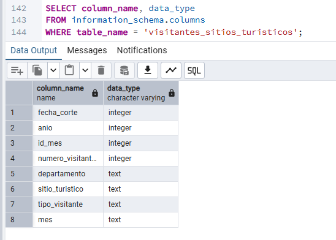

# Análisis de Visitantes a Sitios Turísticos del Perú 2019-2025

Proyecto de análisis de datos usando información abierta de MINCETUR sobre visitantes a sitios turísticos del Perú entre 2019 y 2025.

# Introducción

El turismo es una de las actividades económicas más importantes del Perú, debido a su impacto en la generación de empleo, el desarrollo regional y la promoción del patrimonio cultural y natural del país. El análisis de los flujos turísticos permite comprender el comportamiento de los visitantes, identificar tendencias y evaluar el desempeño de los principales destinos turísticos.

El presente proyecto tiene como objetivo analizar la evolución de los visitantes a sitios turísticos del Perú durante el periodo 2019-2025 utilizando PostgreSQL y consultas SQL. Para ello, se emplearon datos abiertos proporcionados por el Ministerio de Comercio Exterior y Turismo (MINCETUR), los cuales contienen información sobre el número de visitantes, tipo de visitante, ubicación geográfica y periodo de registro.

A través de diferentes consultas SQL se realizaron análisis de visitantes por año, departamento, sitio turístico y tipo de visitante, además de evaluar la recuperación del sector turístico después del impacto generado por la pandemia de COVID-19. Finalmente, los resultados fueron presentados mediante indicadores clave (KPIs) y visualizaciones desarrolladas en Microsoft Excel, facilitando la interpretación de los hallazgos obtenidos.

## Objetivo

Analizar la evolución de visitantes a sitios turísticos del Perú, identificando tendencias anuales, principales destinos, distribución por tipo de visitante y recuperación post-pandemia.

## Herramientas utilizadas

- PostgreSQL
- pgAdmin
- Microsoft Excel
- SQL
## Modelo de Datos

Para el desarrollo del proyecto se utilizó PostgreSQL como sistema de gestión de bases de datos. La información fue almacenada en una tabla denominada visitantes_sitios_turisticos, la cual contiene los registros de visitantes a los principales sitios turísticos del Perú durante el periodo 2019-2025.

La tabla constituye la fuente principal para todas las consultas SQL y análisis realizados en el proyecto.

## Consultas SQL Realizadas

Durante el desarrollo del proyecto se elaboraron diversas consultas SQL con el objetivo de analizar el comportamiento de los visitantes a los principales sitios turísticos del Perú entre 2019 y 2025.

### Exploración y validación de datos

* Visualización de registros para verificar la correcta importación del dataset.
* Conteo total de registros almacenados en la base de datos.

### Análisis de visitantes

* Cálculo del total de visitantes por año.
* Comparación entre visitantes nacionales y extranjeros.
* Análisis de visitantes por mes.
* Evaluación de la tendencia mensual de visitantes por año.

### Análisis geográfico

* Identificación de los sitios turísticos más visitados.
* Determinación de los departamentos con mayor cantidad de visitantes.

### Indicadores y KPIs

* Total de visitantes registrados.
* Total de visitantes nacionales.
* Total de visitantes extranjeros.
* Cantidad de sitios turísticos analizados.
* Cantidad de departamentos incluidos en el estudio.

### Análisis comparativo y recuperación turística

* Comparación de visitantes entre 2019 y 2025.
* Cálculo de la variación porcentual respecto al periodo prepandemia.
* Identificación de los sitios turísticos con mayor crecimiento de visitantes.

### Técnicas SQL Aplicadas

* SELECT
* WHERE
* GROUP BY
* ORDER BY
* SUM()
* COUNT()
* COUNT(DISTINCT)
* CASE WHEN
* HAVING
* LIMIT
* Common Table Expressions (CTE) mediante WITH
* Funciones de agregación y análisis comparativo

Todas las consultas desarrolladas se encuentran disponibles en el archivo `analisis_turismo_peru.sql`.

## Insights principales

- El turismo tuvo una caída significativa en 2020.
- Cusco y Lima concentran la mayor cantidad de visitantes registrados.
- El Circuito Mágico del Agua fue el sitio turístico con mayor número de visitantes.
- En 2025, el total de visitantes se encuentra 1.38% por debajo del nivel prepandemia de 2019.
- Los visitantes nacionales representan la mayor proporción del total analizado.

## Archivos del proyecto

- [`analisis_turismo_peru.sql`](analisis_turismo_peru.sql): consultas SQL utilizadas para el análisis.
- [`dashboard_turismo_peru.xlsx`](dashboard_turismo_peru.xlsx): dashboard desarrollado en Excel.
- [`dashboard_turismo_peru.png`](dashboard_turismo_peru.png): imagen final del dashboard.
- [`Visitantes_sitios_turisticos_2019_2025.csv`](Visitantes_sitios_turisticos_2019_2025.csv): dataset utilizado.

## Fuente de datos

Los datos fueron obtenidos de la Plataforma Nacional de Datos Abiertos del Perú:

[Visitantes a sitios turísticos del Perú - Ministerio de Comercio Exterior y Turismo (MINCETUR)](https://www.datosabiertos.gob.pe/dataset/visitantes-sitios-tur%C3%ADsticos-del-per%C3%BA-ministerio-de-comercio-exterior-y-turismo-mincetur)

Periodo analizado: 2019-2025.
